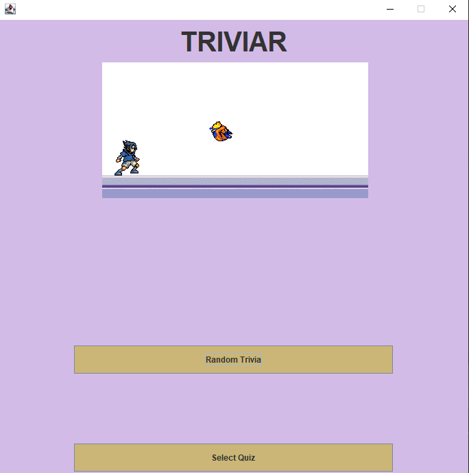
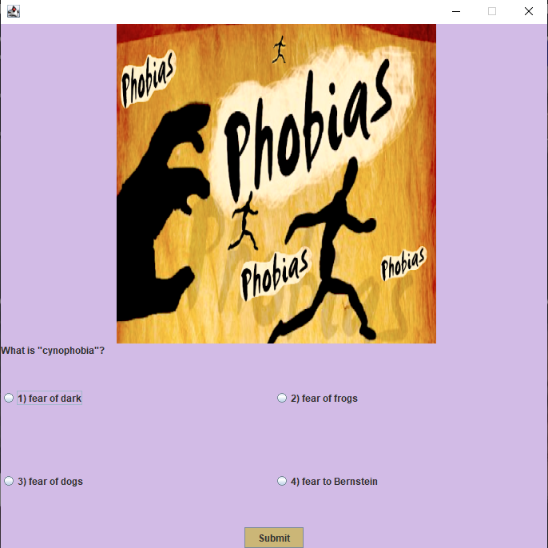
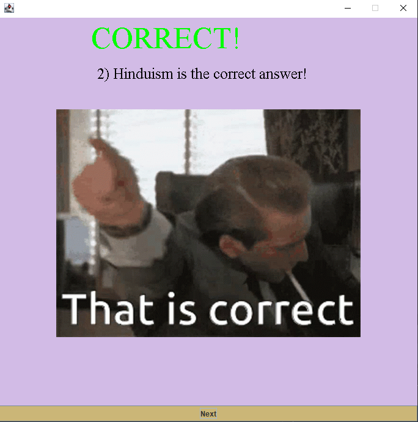
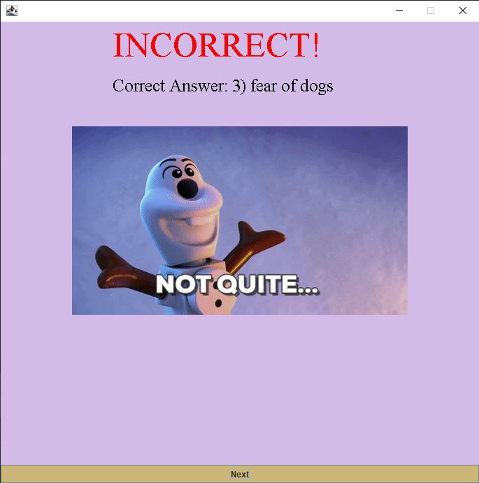
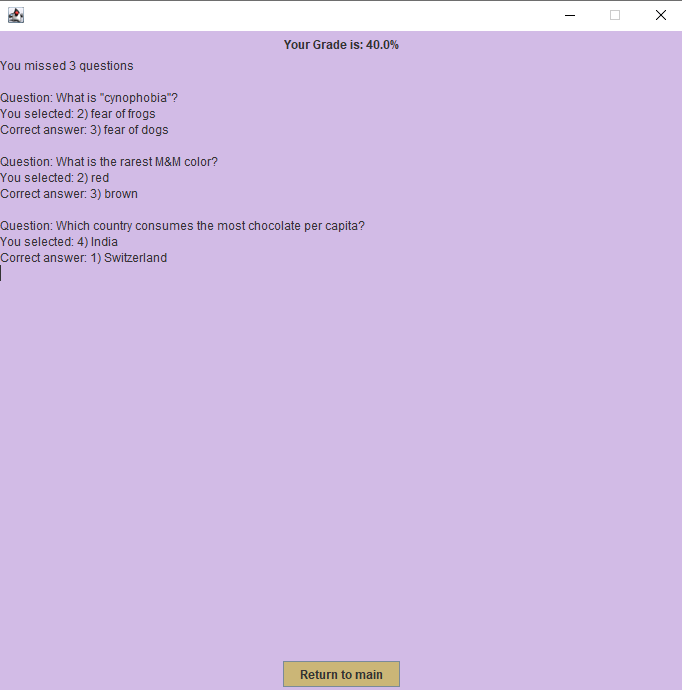

# Triviar

Trivia program that allows you to create your own trivias or select a random one. Funny images and gifs are display throughout the program excetution to make it more fun!

**Interaction Design**

This is the starting window of the Trivia program. You can select a trivia file (.txt) or select a random one built into the program.

Once a valiz trivia file is read, the program will prompted the questions like the this:

If the selected answers is *correct*, then a random .gif likle the following will be prompt

If the selected answer is *incorrect* then a random .gif like the following will be prompt

Once all the questions are answered, the programs will display all the questions that you got wrong along with their respective correct answers and your score on the trivia.

**If you one to create your own Trivia files you must you the following format.**
